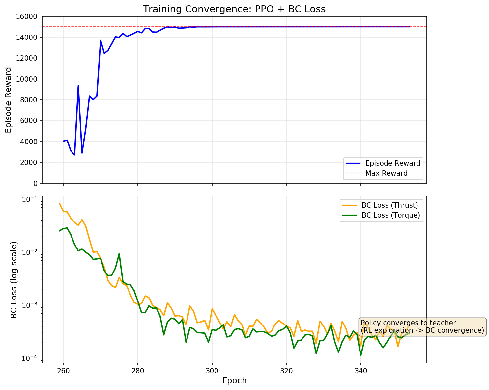
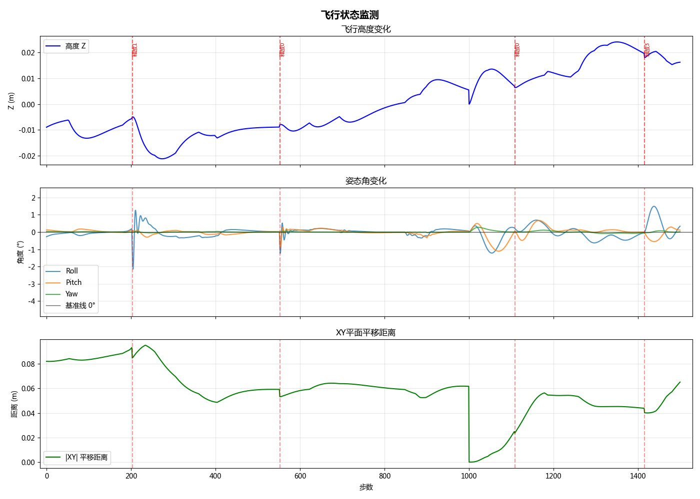
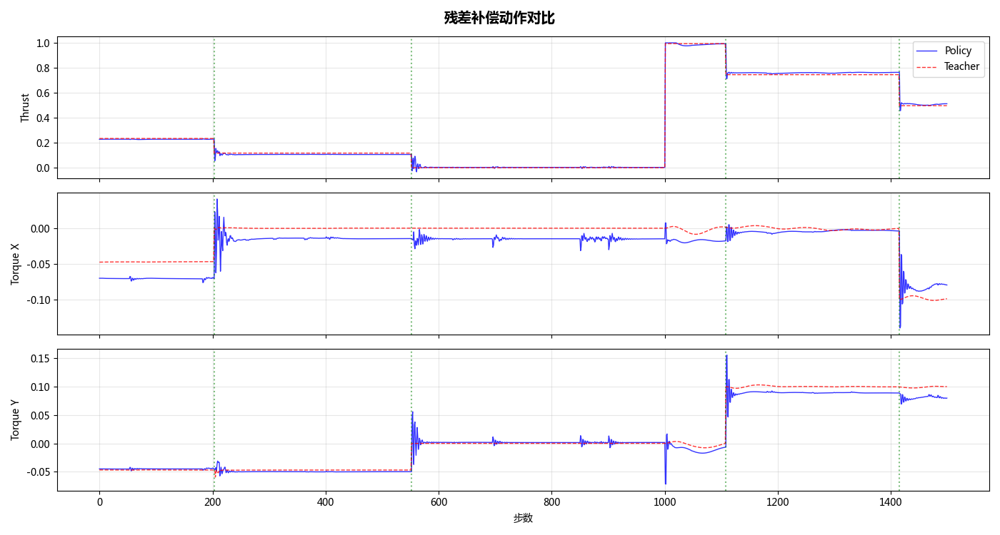
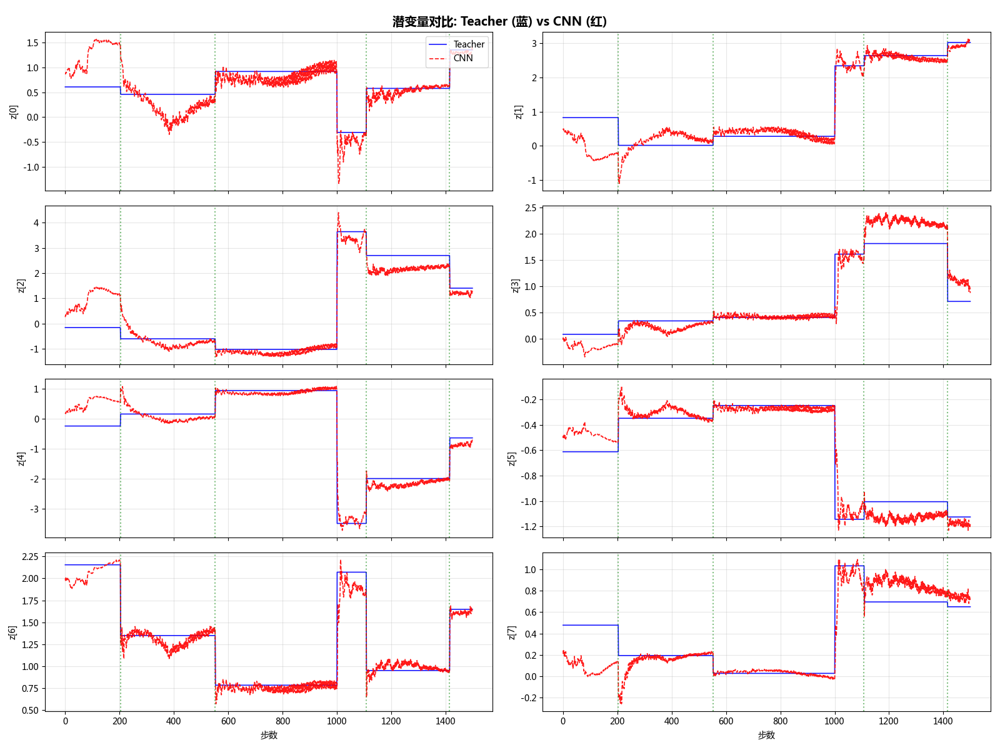
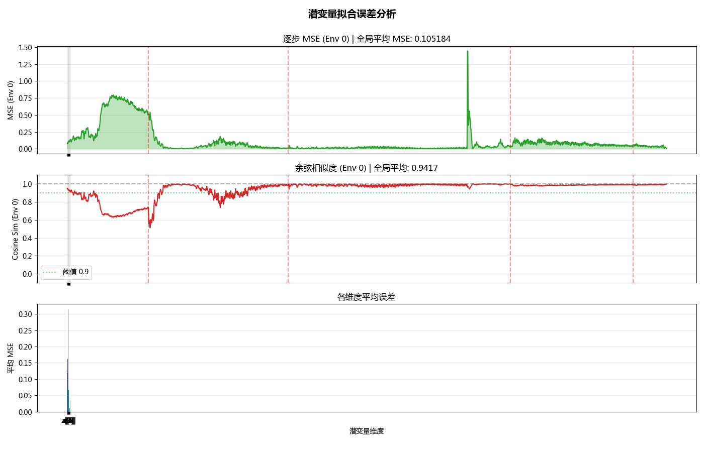

> **摘要** 本文针对四旋翼在载荷释放导致的质量/质心突变下的抗扰动控制，提出一种**结合行为克隆 (BC) 与强化学习 (RL)** 的潜变量蒸馏框架。阶段 1 在仿真中利用特权物理参数构建解析教师，引入**行为克隆损失 (BC Loss)** 约束策略模仿教师残差；同时通过特权编码器与辅助解码器将 18 维特权观测压缩为 8 维潜变量并保持物理语义。阶段 2 仅训练时间序列 1D-CNN 编码器，从历史基础观测预测教师潜变量，以在无特权信息时重建物理表征。控制采用 Lee 位置控制器，策略输出归一化补偿 [thrust, roll, pitch] 叠加到基准控制器（yaw 补偿固定为 0）。本文聚焦标准四旋翼载荷释放与参数摄动（质量/质心、惯量、推力/电机时常、阻力）下的 **抗扰动轨迹跟踪 (Disturbance Rejection)**；外部恒定风扰为可选随机化（默认关闭），不涉及跨构型或故障场景下的 **通用形态适应 (Morphology Adaptation)**。

## 1. 引言 (Introduction)

四旋翼子母无人机作为一种新型复合无人系统，通过母机携带并释放子机的方式，有效突破了传统单机在航程与任务灵活性上的局限。该系统在军事侦察、灾害救援及分布式环境监测等领域展现出巨大的应用潜力。然而，子母机协同作业的核心难点在于“子机释放”动作带来的剧烈扰动：释放瞬间，母机将面临质量突变、质心偏移以及惯量变化带来的瞬时力矩变化。这些复合扰动具有非线性强、时变性快且难以精确建模的特点，对飞行控制系统的鲁棒性提出了严峻挑战。

针对此类大幅度参数摄动问题，现有的控制框架面临着“模型依赖”与“响应速度”的矛盾。传统的基于模型的方法，如前馈控制、自适应控制，高度依赖物理参数的准确性。一旦发生如子机释放般的阶跃式参数突变，预设的模型将失效，导致控制性能急剧下降甚至失稳。而基于反馈的鲁棒控制方法，如主动自抗扰控制（ADRC）和滑模控制（SMC），虽然能通过高增益或观测器抑制扰动，但往往受限于带宽折衷，难以在极短时间内消除大幅度的非平衡力矩。近年来兴起的端到端学习控制虽然反应灵敏，但其“黑箱”特性使得安全性难以保障。

鉴于上述局限，本文**借鉴**足式机器人领域中 Rapid Motor Adaptation (RMA) **[1]** 的“教师-学生”范式，针对四旋翼子母机释放瞬间的“非定常刚体动力学”特性，设计了一套基于**潜变量蒸馏 (Latent Variable Distillation)** 的抗扰动控制策略。该方法并没有停留在通用框架层面，而是通过设计**面向飞行力学的特权观测空间**与**物理一致性参数建模/随机化策略**，攻克了从通用框架到具体飞行任务迁移中的关键难题。它通过简单的残差补偿形式，巧妙地将深度学习的自适应能力嵌入到经典的几何控制环路中，在保证基准安全性的前提下实现了对未知载荷突变的高频响应。

### 1.1 相关工作 (Related Work)

在四旋翼控制领域，前馈控制 (Feedforward Control) 是处理高动态轨迹跟踪的基石。经典工作如 Mellinger 等人提出的微分平坦控制 **[2]** 利用精确的逆动力学模型实现了激进机动。然而，此类方法对模型参数（如质量、惯量）极其敏感，参数误差会导致显著的跟踪误差。虽然自适应控制 (Adaptive Control) **[3]** 试图通过 Lyapunov 稳定性理论在线估计参数，但在面对子机释放这种阶跃式突变时，其参数收敛速度往往滞后于系统动态，难以维持瞬态稳定。

针对外部扰动，主动自抗扰控制 (ADRC) 由 Han 等人 **[4]** 提出，通过扩展状态观测器（ESO）将内扰和外扰统一估计并补偿，在工业界应用广泛。但在处理子机释放引起的瞬态扰动时，ESO 的带宽限制往往导致估计延迟 **[5]**。另一类主流方法是滑模控制 (SMC)，如 **[6]** 综述中所展示的，其通过高频切换增益保证鲁棒性，但不可避免的抖振问题（Chattering）对电机造成了额外负担。

近年来，基于学习的方法逐渐兴起。端到端强化学习如 Loquercio 等人的工作 **[7]** 展现了惊人的敏捷性，但其缺乏可解释性且难以保证安全性。相比之下，Kumar 等人提出的 **RMA [1]** 范式在足式机器人上展示了通过潜变量蒸馏实现 Sim-to-Real 的强大能力，这为鲁棒控制提供了新思路。受此启发，Zhang 等人 **[9]** 最近在四旋翼领域取得突破，提出了一种具备“极致适应性 (Extreme Adaptation)”的底层控制器，通过引入**设计导向的域随机化 (Design-informed Domain Randomization)** 策略，在零样本迁移下成功适应了质量差异巨大的多种异构四旋翼。本文则进一步将这种“潜变量蒸馏+物理一致性随机化”的先进范式，针对性地迁移并解决子母机释放瞬间的剧烈扰动问题。此外，Kulkarni 等人最近提出的 Aerial Gym Simulator **[8]** 为大规模并行化仿真提供了高效平台，本文的训练环境即基于此框架构建。

以下表格总结了各算法的特点对比：

| 算法 | 经典代表作 | 优点 | 缺点 | 适用场景 |
|------|------|------|------|----------|
| **Feedforward** | Mellinger et al. [2] | 响应最快，无滞后 | **极度依赖模型精度** | 精确建模场景 |
| ADRC | Han [4] | 强抗扰能力，工程成熟 | 调优复杂，带宽受限 | 风扰和吊挂负载 |
| SMC | Utkin et al. [6] | 强鲁棒性，理论完备 | 存在抖振，实现复杂 | 高动态负载 |
| **Ours (Proposed)** | (based on RMA [1]) | **快速适应 (类前馈)** | 需双阶段训练 | **未知大幅参变** |

### 1.2 研究范围与贡献 (Scope & Contributions)

本文聚焦于四旋翼子母无人机在执行子机释放任务时的抗扰动控制问题。针对该过程中涉及的质心突变、非定常气动干扰及模型不确定性，我们工作主要包含以下三个方面：首先，构建了基于潜变量蒸馏的分层控制框架，将深度学习的适应能力引入到底层几何控制中；其次，设计了符合飞行力学约束的域随机化策略，解决了从仿真到复杂工况的泛化难题；最后，在高保真物理仿真环境中搭建了完整的释放任务场景，验证了所提方法在极端参数摄动下的鲁棒性。

综上所述，本文的主要贡献总结如下：

1.  **提出了一种“解析教师引导”的潜变量蒸馏控制框架**：
    我们将解析补偿模型作为**强先验知识 (Strong Prior Knowledge)** 引入到 RL 训练中，构建了“特权信息编码 + 残差补偿”的双层架构。与现有端到端方法相比，该框架在保持毫秒级响应速度的同时，提供了明确的物理可解释性（见 2.3 节与 4.3 节潜变量分析）。

2.  **实现了“物理一致性随机化”的工程配置**：
    载荷惯量由点质量模型与偏移量耦合计算，电机推力系数/时间常数与阻力参数在物理范围内随机化，同时提供无物理随机化的对照配置。训练覆盖单载荷质量 $0$–$0.03kg$（4 个载荷总重 $0$–$0.12kg$）的变化范围。

3.  **建立了载荷释放场景下的抗扰动基准**：
    通过载荷管理器在释放时刻更新质量/惯量/质心，构建可复现的释放任务基准（3.1 节），并提供对比实验与消融配置（4.4 节）用于评估核心模块的作用。

---

## 2. 方法论 (Methodology)

本节提出了一种基于潜变量蒸馏的层级化抗扰动控制框架。如图 1 所示，该框架由三个核心模块构成：(1) **基础与残差控制架构**，保证系统的基准稳定性与适应性；(2) **解析教师引导的双阶段训练**，利用特权信息与物理知识加速策略收敛；(3) **物理一致性随机化**，构建高保真数据流以提升 Sim-to-Sim 泛化能力。

> [!TODO] **Figure 1: 系统架构总览**
> 展示 Teacher-Student 蒸馏流程与 Base+Residual 控制回路的交互关系。

### 2.1 系统总览与控制架构 (System Overview & Control Architecture)

我们将控制问题解耦为“基准稳定”与“残差补偿”两部分，既保留了经典几何控制器的安全性，又利用了学习策略的灵活性。

1.  **基础控制器 (Base Controller)**：
    采用标准的 SE(3) 几何控制器 **[10]**，根据期望位置与偏航角计算标称控制量 ($f_{nom}, \tau_{nom}$)。
2.  **残差策略 (Residual Policy)**：
    学习型策略网络 $\pi_\theta$ 输出归一化的残差量 $[\Delta f, \Delta \tau_{rp}]$，最终控制指令为：
    $$ u_{cmd} = [f_{nom} + K_f \Delta f,\; \tau_{nom}^{rp} + K_\tau \Delta \tau_{rp}]^T,\quad \tau_{yaw}=0 $$

### 2.2 第一阶段：解析教师学习 (Phase 1: Teacher Policy Learning)

本阶段的目标是训练一个具备“全知”能力的专家策略。为了方便第二阶段的蒸馏，我们采用了**编码器-主干 (Encoder-Backbone)** 的解耦架构。

1.  **网络架构 (Network Architecture)**:
    教师网络由两部分组成：
    *   **特权编码器 (Privileged Encoder)**: $z_t = \mathcal{E}_{priv}(e_t)$。输入为 18 维特权观测 $e_t$，输出为 8 维潜变量 $z_t$。
    *   **策略主干 (Policy Backbone)**: $a_t = \pi_{\theta}(o_t, z_t)$。输入为基础观测 $o_t$ 与潜变量 $z_t$ 的拼接向量，输出残差动作。
    这种设计确保了策略主干仅依赖于潜变量 $z_t$，而不直接依赖特权信息，从而允许在第二阶段无缝替换编码器。

2.  **状态空间 (State Space)**: 
    *   **基础观测 $o_t \in \mathbb{R}^{20}$**: 包含旋转矩阵 (9)、机体角速度 (3)、4 位载荷附着掩码、释放预警标志 (1) 与上一动作 $a_{t-1}$ (3)。
    *   **特权观测 $e_t \in \mathbb{R}^{18}$**: 包含载荷质量 $m_{sub}$、质心偏移 $r_{com}$、惯量对角项、电机推力系数与时间常数、线/角阻力，以及外部恒定力（若启用）。

3.  **基于行为克隆的解析引导 (Analytical Guidance via Behavior Cloning)**:
    我们将解析教师的输出作为“专家演示”，将 RL 训练建模为 **IL+RL** 混合优化问题。
    教师残差由特权信息计算：COM 重力力矩 $\tau_{payload}$、惯量差的陀螺项 $\tau_{inertia}$，以及可选的等效力矩 $\tau_{force} = - r_{com} \times F_{total}$（默认关闭）。
    roll/pitch 目标为：
    $$ \tau_{comp} = -(\tau_{payload} + \tau_{force}) + \tau_{inertia} $$
    推力补偿对应载荷重力 $g \cdot m_{payload}$，yaw 通道固定为 0。归一化后的残差作为 BC 监督信号。

4.  **奖励函数 (Reward Design)**:
    采用 **PPO** 算法最大化累积奖励。奖励由存活奖励与姿态/角速度/动作平滑惩罚构成；在 teacher_mode 下可加入模仿惩罚以稳定训练。BC 损失在训练器中实现，并对推力/力矩通道设置独立权重。

5.  **潜变量编码 (Latent Encoding)**:
    Teacher 网络内部包含一个 MLP 编码器，将 $e_t$ 压缩为隐变量 $z_t \in \mathbb{R}^8$。辅助解码器 $\mathcal{D}$ 试图从 $z_t$ 重建物理参数，迫使潜变量具备明确的物理语义。

### 2.3 第二阶段：学生策略蒸馏 (Phase 2: Student Policy Distillation)

在实际部署中，特权信息 $e_t$ 不可得。Phase 2 的核心任务是训练一个 **CNN 学生编码器** 来替换 Phase 1 中的 **特权编码器**，而 **策略主干 (Backbone) 保持冻结**。

*   **学生网络架构**: 
    采用时间序列 1D-CNN 作为学生编码器 $\mathcal{E}_{student}$。其输入为机载传感器历史序列 $H_t = [o_{t-H}, ..., o_t]$，输出为预测的潜变量 $\hat{z}_t$。
    $$ \hat{z}_t = \mathcal{E}_{student}(H_t) $$
    由于策略主干 $\pi_{\theta}$ 是冻结的，只需 $\hat{z}_t$ 逼近 $z_t$，整个系统的控制性能就能恢复到教师水平。

*   **蒸馏目标**: 仅更新 $\mathcal{E}_{student}$ 的参数，最小化潜变量空间的重建误差：
    $$ \mathcal{L}_{distill} = \| z_t - \hat{z}_t \|^2 = \| \mathcal{E}_{priv}(e_t) - \mathcal{E}_{student}(H_t) \|^2 $$

*   **物理意义**: 通过这一过程，CNN 实际上学会了从历史轨迹中“辨识”出当前挂载的**子机质量与位置**，并将其压缩为策略主干能理解的 8 维物理表征。

### 2.4 物理一致性域随机化 (Physics-Consistent Randomization)

为了实现从仿真到复杂工况的“极致泛化”，我们摒弃了无约束的独立随机化，转而设计了**设计导向的关联随机化 (Design-informed Randomization)** 策略。

*   **物理约束**: 载荷惯量由点质量模型与偏移量计算，保证与质量/几何一致。
*   **作用**: 训练中对电机推力系数/时间常数与阻力参数做范围随机化（默认 2048 并行环境），外部恒定力为可选随机化。该配置收缩无效解空间并提升泛化稳定性。

---

## 3. 实验设置 (Experimental Setup)

> [!NOTE] 新增章节
> 详细描述实验环境、超参数和评估任务，使实验可复现。

### 3.1 仿真环境与任务
*   **仿真平台**: Aerial Gym **[8]** (基于 Isaac Gym, GPU 加速)。
*   **载荷释放动力学建模 (Numerical Modeling of Release Dynamics)**: 
    鉴于 Aerial Gym 在处理复杂多体接触时的局限性及为了实现扰动参数的可控性，我们不采用刚体铰接 (Rigid Body Joint) 的物理仿真，而是使用载荷管理器直接更新质量/惯量/质心。具体而言，在释放时刻 ($t=t_{release}$)，系统状态发生如下阶跃：
    1.  **载荷附着掩码更新**: 对应载荷被标记为释放，质量与惯量立即重算。
    2.  **质心更新**: 根据剩余载荷偏移量重新计算 $r_{com}$。
    3.  **可选等效力矩**: 若启用 force\_offset\_torque\_scale，则施加 $\tau_{eq} = - r_{com} \times F_{total}$；默认关闭。
    该方法避免了物理引擎中刚体碰撞产生的数值不稳定性，同时允许释放时刻与顺序的可控随机化，从而更严谨地评估控制器的鲁棒边界。
*   **任务流程**: 
    1. **Hover/Tracking**: 跟踪目标点（默认原点；可选随机航点用于验证）。
    2. **Release**: 触发上述释放逻辑，无人机需在扰动下迅速恢复稳态并回归目标悬停点。

**Table 1: 域随机化参数范围 (Domain Randomization Ranges)**

| 参数 (Parameter) | 范围 (Range) | 单位 | 说明 |
| :--- | :--- | :--- | :--- |
| **载荷参数 (Payload)** | | | |
| Payload Mass (per payload) | $[0.00, 0.03]$ | kg | 均匀分布，4 个载荷 |
| Payload Offsets (set) | {$(0.4,0,-0.4)$, $(0,-0.4,-0.4)$, $(-0.4,0,-0.4)$, $(0,0.4,-0.4)$} | m | 默认固定，无平面扰动 |
| **电机参数 (Motor)** | | | |
| Thrust Constant Scale | $[0.7, 1.0]$ | - | 相对标称值缩放 |
| Motor Time Constant ($\tau_m$) | $[0.02, 0.08]$ | s | 一阶响应延迟 |
| **阻力参数 (Drag)** | | | |
| Linear Drag Coefficient | $[0.0, 0.2]$ | N/(m/s) | 线性阻力 |
| Angular Drag Coefficient | $[0.0, 0.05]$ | N·m/(rad/s) | 角阻力 |
| **外部扰动 (Disturbance)** | | | |
| External Force (Wind) | $[0.0, 0.20]$ | N | 可选随机化（默认关闭） |

> [!NOTE] **物理一致性约束**
> 载荷惯量由点质量模型与偏移量计算，确保质量/几何一致；默认训练中 `randomize_offsets_on_plane=False`、`randomize_external_disturbance=False`。

> [!TODO] **Figure 3: 系统架构图**
> 需手绘：展示 Teacher-Student 蒸馏流程与 Base+Residual 控制回路的交互关系。

### 3.2 训练超参数 (Hyperparameters)

**Table 2: 关键训练超参数**

| 参数 (Parameter) | 值 (Value) | 说明 |
| :--- | :--- | :--- |
| **PPO** | | |
| Learning Rate | $3 \times 10^{-4}$ (Adaptive) | 基于 KL 散度自适应调整 |
| Mini-batch Size | 131072 | |
| Horizon Length | 256 | 每个 Actor 收集的 Rollout 长度 |
| Num Actors | 2048 | 并行环境数量 |
| Discount Factor ($\gamma$) | 0.99 | |
| GAE Lambda ($\tau$) | 0.95 | |
| PPO Clip Range ($\epsilon$) | 0.2 | |
| Mini Epochs | 3 | 每批数据重复训练次数 |
| Gradient Norm | 1.0 | 全局梯度裁剪范数 |
| **辅助任务** | | |
| $\lambda_{aux}$ (Aux Loss Coef) | 100.0 | 辅助解码器重建损失系数 |
| Aux Gradient Scale | 0.05 | 辅助损失梯度回传比例 |
| $\lambda_{BC}^{thrust}$ (BC Thrust Coef) | 30.0 | 推力补偿行为克隆权重 |
| $\lambda_{BC}^{torque}$ (BC Torque Coef) | 20.0 | 扭矩补偿行为克隆权重 |
| **网络架构** | | |
| Policy MLP Units | [256, 256, 128] | 策略主干 MLP 层宽度 |
| Privileged Encoder Hidden | 128 | 特权编码器隐层宽度 |
| Latent Dimension | 8 | 潜变量维度 |
| **学生网络 (Phase 2)** | | |
| History Length | 50 | 历史观测序列长度 |
| CNN Architecture | [64, 128, 128] | 时间卷积网络通道数 |

**Figure 2: 训练收敛曲线**

*上图：Episode Reward 收敛曲线（快速达到最大值 ~15000）。下图：BC Loss (log scale)，表明策略从 RL 探索逐渐收敛到模仿教师行为。*

---

## 4. 实验结果与分析 (Simulation Results & Analysis)

### 4.1 标称工况下的抗扰性能 (Nominal Performance)

首先在训练分布内的标称场景下（单载荷质量约 $0.02kg$，随机范围 $0$–$0.03kg$，外部恒定风扰关闭）验证方法的收敛性。
**Figure 4: 飞行状态与补偿动作对比**

*图 4(a): 飞行高度、姿态角与XY位移时序图，红色虚线标注载荷释放时刻。*

*图 4(b): 策略输出 (蓝) 与教师目标 (橙) 的残差补偿对比，包含推力和力矩通道。*

### 4.2 泛化极限评估 (Generalization Limits - "The Money Plot")

为了探究方法的泛化边界，我们以载荷质量范围作为主要难度轴（例如 $[0, 0.01]kg \rightarrow [0, 0.05]kg$），外部恒定风扰作为可选附加轴（$[0, 0.05]N \rightarrow [0, 0.50]N$，需开启 randomize\_external\_disturbance）。

> [!TODO] **Figure 5: 成功率随环境难度变化的曲线 (The Delta Plot)**
> *   **X轴**: 载荷质量 ($0 \to 0.05kg$) 或 外部风扰 ($0 \to 0.50N$)。
> *   **Y轴**: 任务成功率 (Success Rate)。
> *   **曲线**: 
>     1. **Ours (Latent Distillation)**: 曲线平缓，进入高难度区间后才开始下降。
>     2. **Baseline (End-to-End RL)**: 预期在高难度区间性能下降较快。
>     3. **Baseline (Pure PD)**: 预期仅在小扰动范围内有效。
> *   **预期结论**: 验证本文方法在宽范围参数摄动下的“极致适应性 (Extreme Adaptation)”能力。

### 4.3 潜变量的可解释性 (Interpretability of Latents)

学生网络不仅学会了控制，还隐式地学会了“辨识”。
**Figure 5: 潜变量预测对比与误差分析**

*图 5(a): 8维潜变量 Teacher (蓝) vs CNN Student (红) 对比。CNN 成功跟踪教师潜变量的阶跃变化。*

*图 5(b): 潜变量预测误差分析。上：逐步 MSE；中：余弦相似度 (全局平均 0.94)；下：各维度平均 MSE。*

### 4.4 消融实验 (Ablation Studies)

为验证物理参数随机化对泛化能力的影响，我们训练了三个对比模型并在挑战性测试环境下进行评估。

**模型训练设置对比**:

| 参数类型 | 无风扰训练 | 有风扰训练 | 无物理随机化 |
| :--- | :---: | :---: | :---: |
| 载荷质量 (payload_mass) | 随机 [0, 0.03] kg | 随机 [0, 0.03] kg | 随机 [0, 0.03] kg |
| 电机推力系数 (thrust_constant_scale) | 随机 [0.7, 1.0] | 随机 [0.7, 1.0] | **固定 1.0** |
| 电机时间常数 (motor_time_constant) | 随机 [0.02, 0.08] s | 随机 [0.02, 0.08] s | **固定 0.02 s** |
| 线性阻力系数 (lin_drag_coef) | 随机 [0, 0.2] | 随机 [0, 0.2] | **固定 0** |
| 角阻力系数 (ang_drag_coef) | 随机 [0, 0.05] | 随机 [0, 0.05] | **固定 0** |
| 外部恒定风扰 (external_disturbance) | **固定 0** | 随机 [0, 0.2] N | **固定 0** |

> [!NOTE] **模型差异**
> - **无风扰训练**: 包含电机/阻力随机化，不含风扰动随机化
> - **有风扰训练**: 包含电机/阻力/风扰动随机化
> - **无物理随机化**: 关闭所有物理参数随机化（仅保留载荷质量随机化）

#### 4.4.1 不同载荷质量下的极限评估（无风条件）

**测试条件** (所有参数均为固定值):
- 风扰动 = **0 N** (固定)
- 电机/阻力参数 = 标称值 (固定)
- 环境数量 = 256, 评估步数 = 500

| 载荷质量 (固定) | 无风扰训练 | 有风扰训练 | 无物理随机化 |
| :---: | :---: | :---: | :---: |
| 0.01 kg | **100.00%** | 100.00% | 100.00% |
| 0.03 kg | **99.61%** | 96.88% | 98.83% |
| 0.05 kg (OOD) | **85.94%** | 81.25% | 38.67% |

> [!NOTE] **Out-of-Distribution (OOD) 测试**
> 0.05 kg 超出训练范围 [0, 0.03] kg，用于测试模型的泛化极限。

**结论**: 
- **无风扰训练模型表现最佳**：在所有载荷条件下成功率均最高
- 在 0.03 kg 条件下，无风扰训练 (99.61%) > 无物理随机化 (98.83%) > 有风扰训练 (96.88%)
- **超出训练范围** (0.05 kg) 时：无风扰训练 (85.94%) > 有风扰训练 (81.25%) >> 无物理随机化 (38.67%)
- 这表明在无风测试环境下，**不加风扰动随机化**反而表现更好

#### 4.4.2 风扰动下的消融对比

**测试条件** (所有参数均为固定值):
- 载荷质量 = **0.03 kg** (固定)
- 风扰动 = **0.1 N** (固定，无风扰训练和无物理随机化模型训练时从未见过此扰动)
- 电机/阻力参数 = 标称值 (固定)
- 环境数量 = 256, 评估步数 = 500

| 模型 | 成功率 | 崩溃率 | 说明 |
| :--- | :---: | :---: | :--- |
| **无风扰训练** | **99.61%** | 0.39% | 训练时风扰动=0，但泛化能力强 |
| 有风扰训练 | 96.48% | 3.52% | 训练时风扰动随机 [0, 0.2]N |
| 无物理随机化 | 94.92% | 5.08% | 训练时风扰动=0，泛化能力较弱 |

**结论**: 
- **无风扰训练模型在有风测试中也表现最佳** (99.61%)，即使它训练时没有见过风扰动
- 这说明充分的电机/阻力参数随机化可以带来足够的鲁棒性，额外添加风扰动随机化可能**增加训练难度而未必带来更好的泛化**

#### 4.4.3 崩溃判定条件

| 条件 | 阈值 | 说明 |
| :--- | :---: | :--- |
| 位置误差 | > 1.0 m | 无人机到目标的距离超过阈值 |
| 姿态倾角 | > 20° | 机体 Z 轴与世界 Z 轴夹角超过阈值 |

---

## 5. 局限与未来工作

1.  **潜变量解耦**: 强制所有维度物理可解释可能限制了对未建模扰动（如复杂湍流）的适应能力。
2.  **端到端微调**: 当前学生网络仅做蒸馏，未进行端到端 PPO 微调，导致控制性能上限受限于教师。
3.  **实验场景**: 尚未进行实机飞行验证 (Sim-to-Real Only)。

## 6. 结论

本文提出了一种结合物理感知与数据驱动的抗扰动控制框架。通过解析教师引导 RL 训练，并利用潜变量蒸馏将特权能力迁移至机载策略，我们在仿真中实现了对大幅度参数突变（载荷释放）的鲁棒控制。

## 参考文献 (References)

[1] Kumar, A., Fu, Z., Pathak, D., & Malik, J. (2021). RMA: Rapid Motor Adaptation for Legged Robots. *Proceedings of Robotics: Science and Systems (RSS)*.

[2] Mellinger, D., & Kumar, V. (2011). Minimum snap trajectory generation and control for quadrotors. *IEEE International Conference on Robotics and Automation (ICRA)*, 2520–2525.

[3] Slotine, J. J. E., & Li, W. (1991). *Applied nonlinear control*. Prentice-Hall.

[4] Han, J. (2009). From PID to Active Disturbance Rejection Control. *IEEE Transactions on Industrial Electronics*, 56(3), 900–906.

[5] Chen, S., et al. (2019). A survey regarding active disturbance rejection control in flight control. *Journal of Control Science and Engineering*.

[6] Utkin, V. I. (1992). *Sliding Modes in Control and Optimization*. Springer-Verlag.

[7] Loquercio, A., Kaufmann, E., Ranftl, R., et al. (2019). Deep drone acrobatics. *Robotics: Science and Systems (RSS)*.

[8] Kulkarni, M., Rehberg, W., & Alexis, K. (2025). Aerial Gym Simulator: A framework for highly parallelized simulation of aerial robots. *IEEE Robotics and Automation Letters* (accepted / in press).

[9] Zhang, D., Loquercio, A., Tang, J., Wang, T. H., Malik, J., & Mueller, M. W. (2025). A Learning-based Quadcopter Controller with Extreme Adaptation. *IEEE Transactions on Robotics* (to appear).

[10] Lee, T., Leok, M., & McClamroch, N. H. (2010). Geometric tracking control of a quadrotor UAV on SE(3). *49th IEEE Conference on Decision and Control (CDC)*, 5420–5425.
